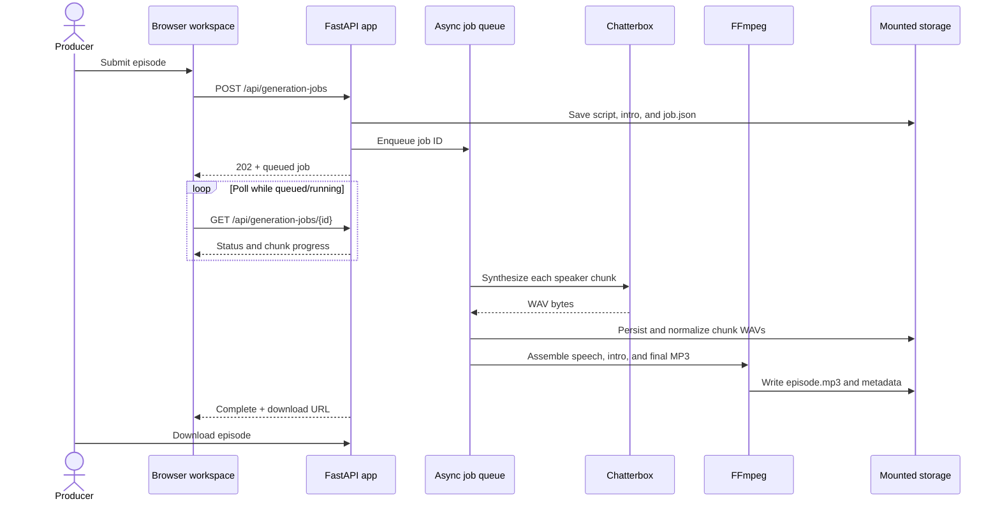

# Codex development contract

This file applies to the entire repository. It is the operating contract for every Codex run in this project. More deeply nested `AGENTS.md` files may add stricter local rules, but they may not weaken the protected-area rules in this file.

## Product context

Patch Notes: America is a browser-based podcast production workspace. It manages a persistent cast, research and conversation drafting, editable episode documents, durable speech generation, final audio assembly, and social clips.

Before changing behavior or architecture, read:

1. `docs/application-design-map.md` for the product, workflow, data, API, and service maps.
2. `README.md` for deployment modes and operating constraints.
3. The tests nearest to the behavior being changed.

Treat the implementation and tests as the source of truth when documentation is stale. Fix stale documentation in the same change unless doing so would cross a protected boundary.

## Required development workflow

### 1. Establish the change boundary

- Read this file and any more specific `AGENTS.md` file governing files you may touch.
- Inspect `git status` before editing. Preserve unrelated user changes and never discard, overwrite, or reformat them.
- Translate the request into explicit acceptance criteria.
- Identify affected user journeys, API contracts, persistent artifacts, and tests by consulting the design map.
- Check the protected-area rules below **before** modifying any file.
- Ask for clarification only when a decision is blocking or destructive. Otherwise, state a conservative assumption in the final report.

### 2. Make the smallest coherent change

- Prefer a focused fix over broad refactoring.
- Follow existing naming, typing, async, validation, and error-handling patterns.
- Keep route handlers thin when practical; put reusable behavior in focused functions.
- Preserve backward compatibility for saved episodes, job manifests, host profiles, media paths, and API responses unless the request explicitly requires a migration.
- Never place `try`/`except` blocks around imports.
- Do not introduce a dependency when the standard library or an existing dependency is sufficient.
- Do not mix unrelated cleanup with the requested work.
- Update relevant documentation when user-visible behavior, an API, an environment variable, storage, or architecture changes.

### 3. Prove the behavior

- Add or update tests for every behavior change and regression fix.
- Prefer deterministic unit tests. Mock external model/network boundaries; do not make routine tests depend on OpenAI, model downloads, a GPU, or a running Docker stack.
- Test the smallest relevant scope first, then run the complete suite when practical.
- The repository test command is:

  ```bash
  PYTHONPATH=. pytest -q
  ```

- Run `git diff --check` before committing.
- For documentation-only changes, validate links, paths, examples, and Mermaid syntax where tooling is available; the full test suite is still preferred.
- If a check cannot run because of an environment limitation, report the exact limitation. Do not claim it passed and do not silently omit it.
- A pre-existing failure must be clearly separated from failures caused by the change.

### 4. Review the patch

Before committing, review the complete diff for:

- correctness against the acceptance criteria;
- accidental changes and generated files;
- secrets, credentials, personal data, and oversized binary artifacts;
- API and persistence compatibility;
- failure behavior, retries, cleanup, and actionable error messages;
- accessibility and responsive behavior for interface changes;
- matching tests and documentation.

### 5. Commit and report

- Keep the working tree free of generated caches such as `__pycache__/`.
- Use an imperative, scoped commit subject that explains intent (for example, `docs: define Codex development contract`).
- Do not amend, squash, force-push, or rewrite user-authored commits unless explicitly requested.
- Follow the repository task's pull-request instructions when a PR tool is available.
- End every run with the exact **Change Report** format below. Do not replace it with a generic summary.

## Protected areas — explicit approval required

Protected areas are **read-only by default**. Codex may inspect and describe them, but must not edit, move, delete, rename, reformat, or indirectly change their behavior without specific approval in the current user request.

Approval is specific only when the user names the protected area (or the concrete protected files/functions/routes) and explicitly authorizes modifying it. A broad request such as “improve the app,” “fix generation,” “refactor,” or “update dependencies” is **not** approval. Approval from an earlier run does not carry forward.

If a requested change appears to require protected work:

1. Stop before editing the protected area.
2. Explain which boundary is implicated, why it is necessary, the smallest proposed change, risks, and validation/rollback plan.
3. Ask for explicit approval.
4. Do not bypass the boundary by changing callers, schemas, configuration, or tests to produce the same protected behavioral change.

### P0: Rendering and recovery pipeline

This is the first and highest-priority protected area. Preserve this contract exactly unless the user explicitly approves changing the **rendering and recovery pipeline**:



Protection includes direct and indirect changes to:

- `POST /api/generation-jobs`, `GET /api/generation-jobs`, and `GET /api/generation-jobs/{job_id}` contracts;
- `create_generation_job`, `generation_worker`, `process_generation_job`, job startup/re-enqueue logic, retry logic, and job status/progress transitions in `app/main.py`;
- `job.json` creation, migration, atomic writes, fields, state meanings, and recovery semantics;
- script/intro persistence performed when a job is accepted;
- speech chunk ordering, naming, reuse, validation, normalization, and persistence;
- the application-to-Chatterbox synthesis boundary and WAV response expectations;
- FFmpeg assembly order, intro mixing, final MP3 creation, metadata output, and download availability;
- browser submission, job polling, progress presentation, and completed-download behavior in `app/templates/index.html`;
- environment variables, Compose mounts, worker counts, timeouts, or dependency changes that alter any behavior above;
- tests that encode these guarantees. Tests may be added around the boundary, but existing guarantees must not be weakened, skipped, or rewritten without approval.

Changes outside these files are still protected when their effect changes this sequence or its recovery guarantees. Pure documentation corrections that do not redefine the contract are permitted; any changed promise or sequence requires approval.

### P1: Persistent data and compatibility contracts

Explicit approval to change **persistent data contracts** is required for any modification to:

- `config/host_profiles.json` and host/reference-voice identity;
- saved episode documents under `episodes/saved/`;
- research packets under `config/research_packets/`;
- episode metadata, media filenames, or public download paths under `output/`;
- parsing/migration behavior that could make existing user data unreadable or silently discard fields.

Even additive, backward-compatible changes require approval and must include defaults, round-trip tests, and documentation. Destructive migrations additionally require an approved backup and rollback plan.

### P1: Deployment, device safety, and secrets

Explicit approval to change **deployment/device safety** is required for modifications that:

- weaken fail-closed CUDA/device validation or Chatterbox health and smoke-test readiness;
- alter production port exposure, volume ownership, or the CPU/GPU Compose boundary;
- expose services beyond their current bind-address defaults;
- change credential handling or commit any secret.

Never commit `.env` contents, API keys, tokens, private voice recordings, generated episode media, or model weights. This prohibition cannot be overridden by ordinary approval; use secure configuration or approved artifact storage instead.

## Architecture and code expectations

### FastAPI and Python

- Validate all external input and return useful, non-sensitive errors.
- Keep blocking FFmpeg/file work out of new async hot paths where it would stall request handling; follow established worker boundaries.
- Use `Path` for filesystem operations and constrain user-derived paths to intended roots.
- Use atomic replacement for durable state that recovery depends on.
- Preserve the difference between retryable external failures and permanent validation failures.
- Type new public helpers and keep functions focused enough to test directly.

### Browser interface

- Use semantic HTML, associated labels, keyboard-operable controls, and live regions for asynchronous feedback.
- Preserve form data across recoverable errors.
- Provide loading, empty, success, and failure states for every new asynchronous interaction.
- Keep the existing responsive breakpoints and dark visual language unless a redesign is requested.
- Avoid introducing a frontend framework for a localized change.

### Audio and external services

- Treat model and network responses as untrusted; validate type, status, size, and media format.
- Keep temporary-file cleanup reliable on success and failure.
- Never claim GPU behavior was validated unless it ran on the target GPU environment.
- Do not make external-provider availability a prerequisite for loading or editing saved work.

## Predictable Change Report

Every final response for a change must use these headings, in this order. Include every heading; use `None` where appropriate.

```markdown
## Change Report

### What changed
- Concrete change with file and line citations.

### Why
- User problem or requirement addressed.

### Expected behavior
- Observable result, including important unchanged behavior.

### Validation
- ✅ `exact command` — outcome.
- ⚠️ `exact command` — environment limitation, if any.
- ❌ `exact command` — failure caused by the work, if any.

### Protected areas
- `None`, or approval received, protected boundary touched, and safeguards/tests used.

### Risks and follow-ups
- Remaining risk, assumption, migration note, or `None`.

### Commit
- `<short-sha> <subject>`
```

Rules for the report:

- State facts only; do not say a behavior is fixed without a validating check or clearly labeled manual expectation.
- Cite changed files using the required repository citation format when the environment supplies one.
- Prefix every validation command with `✅`, `⚠️`, or `❌`. `⚠️` is only for an environment limitation, not a code failure.
- Mention protected areas even when none were touched.
- Note user-visible behavior that is intentionally unchanged.
- If no files changed, say so clearly, omit the commit line, and do not create a commit or pull request.

## Keeping the design map current

Update `docs/application-design-map.md` in the same approved change when introducing a new primary object, workflow stage, service boundary, persistent artifact, API group, or top-level screen region. The design map documents the application; it does not grant permission to cross a protected boundary.
