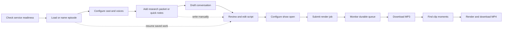
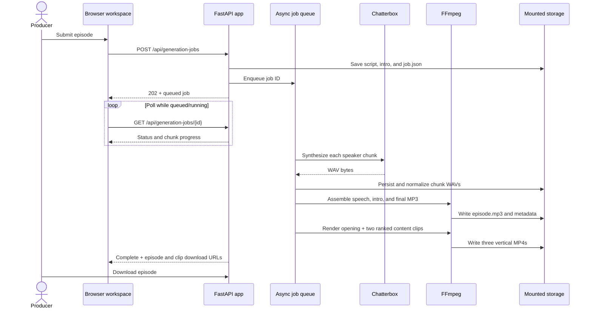
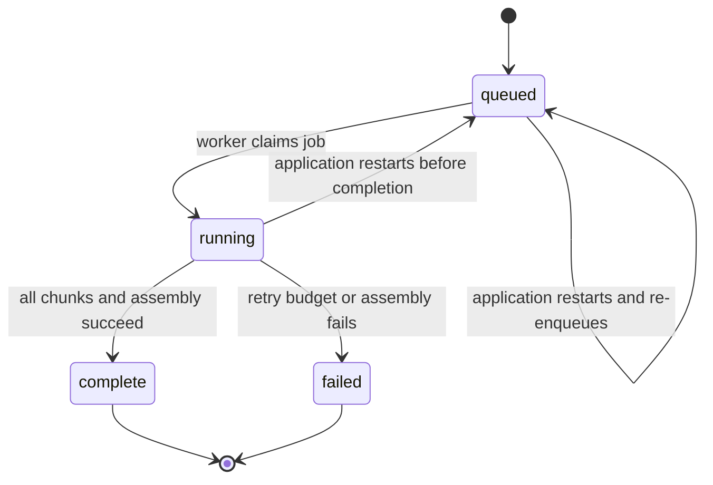

# Application design map

This document is the shared product, interface, and system map for **Patch Notes: America**. It describes the application as it exists today so that product, design, and engineering work can start from the same model.

## 1. Product at a glance

**Purpose:** turn researched story material into an editable, character-driven, multi-host podcast, synthesize it with persistent host voices, and make downloadable episode and social-clip assets.

**Primary user:** a podcast producer who owns the entire workflow—from cast and source preparation through the final audio export.

**Core object hierarchy:**

```text
Workspace
├── Persistent cast
│   └── Host profile + reference voice + performance settings
├── Saved episodes
│   ├── Research packet / quick notes
│   ├── Conversation settings
│   ├── Editable script
│   └── Show-open settings + optional intro track
└── Rendered episodes
    ├── Durable generation job + speech chunks
    ├── Final MP3
    └── Suggested and rendered social clips
```

## 2. Experience map

The product is a single, vertically scrolling production workspace. The usual path is left-to-right below; users can also skip AI drafting and write a script directly.



### Key user states

| Stage | User goal | System feedback | Exit condition |
| --- | --- | --- | --- |
| Readiness | Confirm audio generation is available | Service status, diagnostic detail, Chatterbox link | Chatterbox reports synthesis-ready |
| Episode setup | Start new work or resume a saved episode | Saved-episode selector and save status | Episode has a title |
| Cast | Establish speakers and their behavior | Voice badge, upload/preview status, inline controls | At least one valid host exists |
| Research | Assemble facts and framing | Packet save/draft status | Packet or source notes are present |
| Writing | Produce and refine dialogue | Editable script with speaker-tag guidance | Required script is non-empty |
| Show open | Add intro music and spoken intro | File state, overlap toggle, volume value | Optional settings are accepted |
| Rendering | Generate speech without holding the page open | Submit progress, queue state, chunk count, timer/errors | Job is complete or failed |
| Distribution | Extract a shareable moment | Suggested windows, clip controls, rendered result | MP4 is downloadable |

## 3. Screen and information architecture

```text
Podcast Builder
├── Product header
├── Services status card
├── Episode form
│   ├── Episode file (load / save)
│   ├── Episode title
│   ├── Cast
│   │   └── Repeating host card
│   │       ├── Identity and role
│   │       ├── Reference voice and preview
│   │       ├── Core + advanced Chatterbox controls
│   │       └── Character personality
│   ├── Conversation engine
│   │   ├── Collapsible research packet
│   │   ├── Quick story / source notes
│   │   └── Duration and tone
│   ├── Episode script
│   ├── Show open
│   └── Generate action
├── Latest result
├── Background render queue
└── Clip Studio (revealed after a completed episode is selected)
```

### Responsive behavior and visual language

- The workspace is constrained to `980px` and centered on a dark canvas.
- Cards establish the major hierarchy; nested bordered panels group hosts, intros, and clip editing.
- Green is the primary action/success color, blue indicates active/informational state, red indicates destructive/error state, and muted gray supports secondary copy.
- Multi-column host, queue, and clip controls collapse progressively at `900px`, `760px`, and `700px` breakpoints.
- Native inputs, disclosure widgets, file pickers, and audio players keep the interaction model lightweight and accessible.

## 4. Interaction model

### Episode and cast editing

- The browser keeps the active form state and serializes host cards into `hosts_json` before saving or rendering.
- Saving an episode persists its editable document and copies its uploaded intro track into that saved episode's directory.
- Host profiles are workspace-level entities. A host can use a legacy Chatterbox voice or a normalized, host-specific reference recording.
- Voice preview is transient: it synthesizes sample text, returns WAV audio, and removes the preview artifact after the response is served.

### Conversation generation

- The producer can draft from quick notes or from a structured, multi-story research packet.
- The backend builds a cast-aware prompt containing personalities, target duration, tone, source constraints, and required speaker-tag syntax.
- Generation uses the configured OpenAI provider by default or an optional local Ollama-compatible service.
- Generated dialogue always returns to the editable script field; it is not sent directly to rendering.

### Rendering and recovery



Jobs are filesystem-backed rather than browser-backed. On application startup, incomplete manifests are re-enqueued, valid completed chunks are reused, and a producer can leave and later return to the queue.

### Clip production

The completed episode metadata is enriched with a chunk timeline. After MP3 assembly, the worker automatically renders a vertical opening clip and up to two non-overlapping content clips scored for strong hooks, useful duration, and multiple speakers. Clip errors are recorded without failing the completed episode. The producer may also accept a suggestion or set exact bounds, title, and aspect ratio. FFmpeg produces a captioned MP4 in vertical (`9:16`), square (`1:1`), or horizontal (`16:9`) format.

## 5. System architecture

```mermaid
flowchart TB
    Browser[Browser\nHTML + CSS + vanilla JavaScript]

    subgraph App[FastAPI application container :8080]
        Routes[UI and JSON/form routes]
        Domain[Episode, cast, script, and clip logic]
        Workers[Persistent async render workers]
        Audio[Audio validation, normalization, and stitching]
    end

    subgraph Speech[Chatterbox container :8000]
        Health[Model health + synthesis smoke test]
        SpeechAPI[POST /v1/audio/speech]
        Model[Chatterbox TTS model]
    end

    AI{Conversation provider}
    OpenAI[OpenAI Responses API]
    Ollama[Optional Ollama service :11434]
    FFmpeg[FFmpeg subprocess]

    subgraph Storage[Bind-mounted filesystem]
        Config[config/host_profiles.json]
        Voices[data/voices/{host}/reference.wav]
        Saved[episodes/saved/{id}/]
        Packets[config/research_packets/]
        Output[output/{job}/]
    end

    Browser <--> Routes
    Routes --> Domain
    Routes --> Workers
    Workers --> SpeechAPI
    SpeechAPI --> Model
    Routes --> Health
    Domain --> AI
    AI --> OpenAI
    AI --> Ollama
    Domain --> FFmpeg
    Workers --> FFmpeg
    Domain <--> Storage
    Workers <--> Storage
    Audio <--> Workers
```

### Responsibility boundaries

| Layer | Owns | Does not own |
| --- | --- | --- |
| Browser | Form state, dynamic host/story cards, validation cues, polling, rendering API results | Durable job execution or canonical persistence |
| FastAPI routes | Input validation, orchestration, downloads, provider boundaries | TTS model inference |
| Domain/audio functions | Script cleanup/chunking, speaker mapping, prompts, quality checks, assembly, clip timing | Presentation layout |
| Render workers | Queue consumption, retries, resumability, manifest transitions | User session state |
| Chatterbox service | Model lifecycle, device validation, voice discovery, WAV synthesis | Episode semantics or final assembly |
| Filesystem | Editable documents, references, manifests, intermediates, exports | Querying or relational integrity |

## 6. Data and artifact map

| Location | Artifact | Lifecycle |
| --- | --- | --- |
| `config/host_profiles.json` | Persistent host identities, personalities, and synthesis settings | Replaced when cast is saved |
| `data/voices/<host-id>/reference.wav` | Normalized reference voice per host | Created/replaced/deleted through host voice APIs |
| `episodes/saved/<episode-id>/episode.json` | Complete editable episode document | Created or updated by Save episode |
| `episodes/saved/<episode-id>/intro.*` | Saved intro source file | Optional; copied with episode |
| `config/research_packets/<packet-id>.json` | Structured story packet | Saved independently for reuse |
| `output/<job-id>/job.json` | Durable render manifest and status | Updated atomically throughout rendering |
| `output/<job-id>/chunk-*.wav` | Raw and normalized speech segments | Reused during retry/resume |
| `output/<job-id>/metadata.json` | Episode, speaker, chunk, and timing metadata | Produced/enriched with the episode |
| `output/<job-id>/<slug>.mp3` | Finished episode | Downloadable result |
| `output/<job-id>/clips/*.mp4` | Captioned social exports | Created on demand |

### Editable episode document

```text
Episode
├── version, title
├── hosts[]
│   ├── id, name, role
│   ├── voice / reference voice state
│   ├── tempo + Chatterbox parameters
│   └── personality and speaking behavior
├── research_packet { angle, stories[] }
├── story_notes
├── target_minutes + conversation_tone
├── script
└── intro_lines + overlap + music volume + optional audio file
```

## 7. API surface map

| Area | Methods and paths | Purpose |
| --- | --- | --- |
| Workspace | `GET /`, `GET /api/health` | Render the workspace and report end-to-end readiness |
| Cast | `GET/POST /api/host-profiles` | Load and replace persistent cast configuration |
| Voices | `GET /api/chatterbox-voices`; `POST/DELETE /api/hosts/{id}/voice`; `GET .../voice/audio`; `POST .../voice/preview` | Discover legacy voices and manage per-host references |
| Episodes | `GET/POST /api/saved-episodes`; `GET /api/saved-episodes/{id}` | List, save, and restore editable episodes |
| Research | `GET/POST /api/research-packets`; `GET /api/research-packets/{id}` | Persist structured source packets |
| Drafting | `POST /api/conversation-draft`; `POST /api/conversation-draft-packet` | Generate an editable multi-host script |
| Rendering | `POST/GET /api/generation-jobs`; `GET /api/generation-jobs/{id}` | Create, list, and monitor durable jobs |
| Compatibility | `POST /api/generate`; `POST /api/chunk-preview` | Synchronous generation and chunk inspection paths |
| Downloads | `GET /api/episodes/{slug}/download` | Serve the completed MP3 |
| Clips | `GET /api/episodes/{slug}/clip-suggestions`; `POST /api/episodes/{slug}/clips`; `GET .../clips/{clip-id}/download` | Suggest, render, and serve social clips |

The internal Chatterbox boundary exposes `GET /health`, `GET /voices`, and `POST /v1/audio/speech`.

## 8. Operational states and failure design



- Episode submission remains disabled until Chatterbox passes model loading and a real synthesis smoke test.
- Each TTS request validates that the response is a WAV/RIFF payload; audio is then checked and normalized before assembly.
- Final MP3 assembly measures the complete program and applies two-pass EBU R128 mastering at -14 LUFS integrated with a -1.5 dB true-peak ceiling.
- Retryable TTS failures use a configurable attempt count and delay. The manifest records progress and errors for the queue UI.
- GPU mode is fail-closed: a requested CUDA device must actually resolve to CUDA. CPU is the portable default.
- Uploaded voice and intro files are size-limited and normalized through FFmpeg before production use.

## 9. Design constraints and extension points

### Current constraints

- The single-page workspace favors a solo producer; there are no accounts, authorization boundaries, or concurrent-edit resolution.
- Persistence is file-based, so IDs and directory structure act as the record index.
- The page JavaScript and markup share one template, making the current experience easy to deploy but increasingly costly to modularize.
- The render queue is process-local with durable manifests; multiple app replicas would need coordinated job claiming.
- Conversation quality depends on user-supplied, verified notes—the interface does not independently verify sources.

### Natural extension points

1. **Workspace navigation:** split Cast, Research, Episodes, Queue, and Distribution into stable views while preserving the object hierarchy above.
2. **Shared production:** add users, roles, revision history, and review/approval states around saved episodes.
3. **Structured storage:** move searchable metadata and job claims to a database/queue while retaining object storage for media.
4. **Editorial confidence:** show citations and source coverage beside generated script passages.
5. **Observability:** expose per-chunk timing, retry history, inference device, and cost/latency summaries in the queue.
6. **Distribution system:** add reusable visual templates, safe-area previews, caption editing, and platform-specific exports.

## 10. Source-of-truth index

| Concern | Implementation source |
| --- | --- |
| Route, domain, persistence, and worker behavior | `app/main.py` |
| Page structure and browser interactions | `app/templates/index.html` |
| Visual tokens, layout, and breakpoints | `app/static/styles.css` |
| Audio validation and stitching | `app/audio_utils.py` |
| TTS service contract and device health | `chatterbox/server.py` |
| Runtime topology and mounted storage | `docker-compose.yml`, `docker-compose.gpu.yml` |
| Expected behavior | `tests/` |

Update this map whenever a change introduces a new primary object, workflow stage, service boundary, persistent artifact, or top-level screen region.
